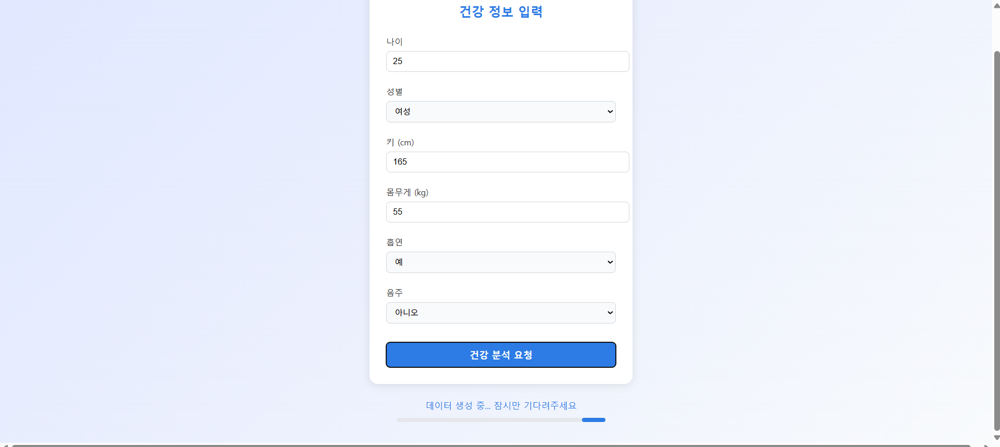

## healthChecker

### 목차
1. 프로젝트 개요
2. 기능 소개
3. 기술 스택
4. 폴더 구조
5. 화면 예시
6. 회고 및 향후 발전 방향

### 프로젝트 개요
- 사용자가 입력한 건강 정보(나이, 키, 몸무게, 흡연/음주 여부)를 기반으로 건강 관련 조언 제공
- BMI 계산 및 현재 상태 분석
- ChatGPT 기반의 건강 가이드 생성
- PDF 문서를 기반으로 RAG(Retrieval-Augmented Generation) 응답 생성
- React 프론트엔드를 Nginx로 배포

### 기술 스택
  
| 구성                  | 기술                     |
| --------------------- | ------------------------ |
| Language              | Java 21                 |
| Build Tool            | Gradle                   |
| Backend Framework     | Spring Boot 3.2.5        |
| Frontend              | React 19, Vite           |
| Deployment            | Nginx                    |
| Version Control       | Git + GitHub             |

### 기능 소개
| 기능         | 설명                              |
| ------------ | ------------------------------- |
| 💬 건강 상담 | 사용자의 건강 데이터를 기반으로 ChatGPT가 맞춤형 가이드 제공 |
| 📜 건강 상담 이력  | 사용자의 건강 상담 내역을 카드 형태로 제공      |
| 🧮 BMI 계산 | 키, 몸무게 입력 시 자동으로 BMI 계산 및 상태 분석     |


### 폴더 구조
```
healthChecker/
├── healthChecker-backend/
│   ├── src/
│   │   └── main/java/PT_BO/healthchecker/
│   │       ├── config/         # Spring AI 및 RAG 설정
│   │       ├── controller/     # API 엔드포인트
│   │       ├── dto/            # 요청/응답 DTO
│   │       └── service/        # 비즈니스 로직
│   ├── resources/
│   │   └── healthchecker-bmi-guide.pdf  # RAG용 가이드 PDF
│   └── build.gradle            # Gradle 설정 파일
│
├── healthChecker-frontend/
│   ├── public/
│   ├── src/
│   │   ├── App.tsx
│   │   ├── HealthForm.jsx      # 건강 정보 입력 컴포넌트
│   │   ├── main.jsx
│   │   └── vite.config.ts
│   └── nginx.conf              # 로컬 Nginx 설정 파일

```
### 화면 예시




### 향후 발전 방향
- 본 프로젝트는 개발 소모임에서 단기간 기획/제작된 프로젝트로, 기획부터 배포까지 전 과정을 경험하며, 빠르게 프로토타입을 구현해보는 것을 목표로 삼았습니다.
- DB 연동 및 사용자별 건강 기록 저장 기능 확장 예정입니다.
- Chart UI를 추가하여 UI를 개선할 예정입니다.


